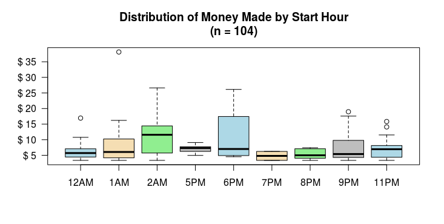

# Lyft
Dataset from Lyft driving in Colorado

# Analysis 
Part 1 - http://www.beardedanalytics.com/analyzing-lyft-data-part-i/

# Data Dictionary 

### RideNumber 
Increasing integer denoting ride number

### Date 
Date of the start of the ride

### Time 
Time of the start of the ride

### Distance 
Distance driven in miles during ride, does not include drive miles driven to pickup passenger

### Time_Min 
Ride duration in whole minutes

### Time_Sec 
Ride duration in whole seconds

### Amount 
Amount received from Lyft in US Dollars

### Tip 
Amount tipped by rider in US Dollars

### Cancel 
Dichotomous indicator 'Yes' or 'No' for cancelled rides

### LyftLine 
Dichotomous indicator 'Yes' or 'No' for shared rides (Lyft Line)

### HoursLoggedIn 
Hours spent in driver mode

### MinutesLoggedIn 
Minutes spent in driver mode

### SecondsLoggedIn
Seconds spent in driver mode

### Get Started 

